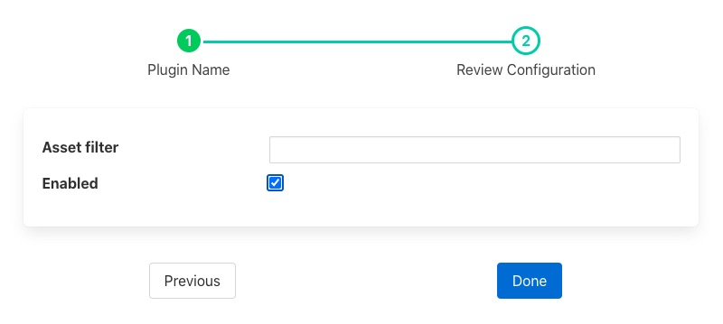

.. Images

Log Filter
==========

The *fledge-filter-log* plugin is a simple filter that converts data to a logarithmic scale.

When adding a scale filter to either the south service or north task, via the *Add Application* option of the user interface, a configuration page for the filter will be shown as below;

+-------+
| |log| |
+-------+

The *Asset Filter* entry is a regular expression that can be used to limit the assets that the filter will effect. To change all assets leave this entry blank.
